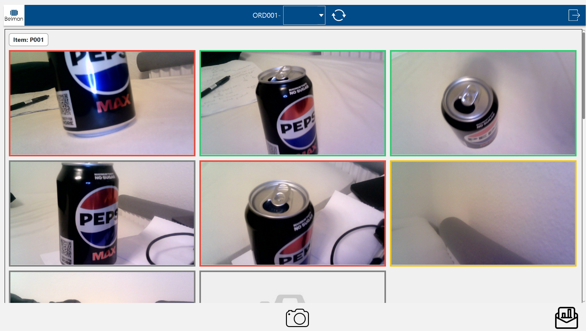

## Purpose
Exam assignment 2025 BASW Esbjerg

- Create a plugin for the company's existing platform
- plugin should let users capture and store quality control documentation
- plugin should let users approve documentation and send it to customers

## Features

- Basic admin management system
- Capture and store photos linked to specific products
- Tag photos with issue types or mark them as **Approved**/**Rejected** for quality control
- Generate a PDF Quality assurance report
- Email PDF reports to customers

## Screenshot
